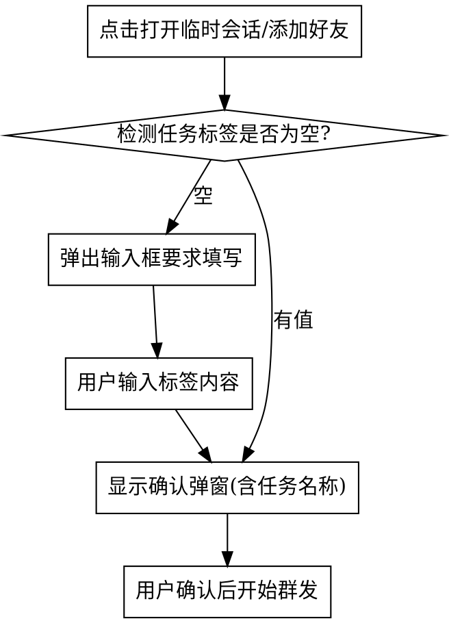

# QQ 群发任务标签功能设计

> 日期: 2026-05-09
> 状态: 待实现

## 功能概述

为 QQ 群发工具添加任务标签功能，允许用户对整批次群发任务进行统一备注标注，在批量打开窗口时能快速识别当前任务目的。

## 用户需求

- 打开多个 QQ 临时会话窗口时，能一眼看出当前任务对应什么内容
- 任务标签是对整批次任务的统一备注，不是每个 QQ 单独标注
- 每次新任务开始前必须填写标签（空则弹出输入框）
- 重置时清空标签内容
- 标签不持久化（刷新页面清空）

## UI 设计

### 新增元素位置

在统计面板（`bc-stats`）上方新增任务标签卡片：

```
┌─────────────────────────────────────┐
│ 📋 当前任务                          │  ← 标签头部
│ [发送产品介绍              ] [编辑] │  ← 任务名称 + 编辑按钮
└─────────────────────────────────────┘
┌─────────────────────────────────────┐
│ 统计: 总计 10 | 已打开 0 | 剩余 10   │  ← 原有统计面板
└─────────────────────────────────────┘
```

### 样式规格

- 卡片背景: `var(--bg2)`
- 边框: `var(--border)`
- 圆角: `var(--radius-lg)`
- 头部文字: 12px, `var(--text3)`, uppercase
- 任务名称: 14px, `var(--text)`, 加粗
- 编辑按钮: `btn-ghost btn-sm`

## 交互流程

### 开始群发流程



### 确认弹窗内容

确认弹窗标题修改为显示任务名称：
- 原: `确认群发`
- 新: `确认群发 - [任务名称]`

弹窗内容保持不变，显示数量统计。

### 重置流程

点击重置按钮时：
- 清空 `bcQueue`, `bcIndex`, `openedWindows`, `failedQQs`
- 清空任务标签内容
- 隐藏任务标签卡片（或显示"未设置任务"提示）

### 编辑标签

点击编辑按钮：
- 弹出简易输入框（prompt 或自定义 modal）
- 用户输入后更新标签显示

## 代码修改点

### HTML 结构

新增任务标签卡片区域：

```html
<!-- 任务标签 -->
<div class="card task-label-card" id="task-label-card" style="display:none;">
  <div class="card-label">📋 当前任务</div>
  <div style="display:flex;align-items:center;gap:12px;">
    <span class="task-name" id="task-name" style="flex:1;font-size:14px;font-weight:500;"></span>
    <button class="btn btn-ghost btn-sm" onclick="editTaskLabel()">编辑</button>
  </div>
</div>
```

### JavaScript

新增状态变量：
```js
let taskLabel = ''; // 当前任务标签
```

修改函数：

1. `startBroadcast(mode)` - 添加标签检测逻辑：
   ```js
   if (!taskLabel) {
       askTaskLabel();
       return;
   }
   ```

2. 新增 `askTaskLabel()` - 弹出输入框要求填写标签

3. 新增 `editTaskLabel()` - 编辑已有标签

4. `resetBroadcast()` - 清空 `taskLabel` 并隐藏标签卡片

5. `confirmBroadcast()` - 更新确认弹窗标题显示任务名称

## 样式新增

```css
.task-label-card {
    border-left: 3px solid var(--primary);
}

.task-name-empty {
    color: var(--text3);
    font-style: italic;
}
```

## 数据持久化

- **不持久化** - 任务标签不存入 localStorage
- 每次刷新页面、重置后清空
- 符合"每次任务独立"的使用场景

## 边界情况

| 场景 | 处理方式 |
|------|----------|
| 用户取消输入标签 | 不继续群发，停留在当前状态 |
| 标签过长 | 限制最大长度 50 字符，超出截断显示 |
| 编辑后标签为空 | 提示"标签不能为空"，保持原值 |
| 中途继续群发 | 使用已有标签，无需重新输入 |

## 测试要点

1. 新任务开始，未填写标签 → 弹出输入框
2. 输入标签后确认弹窗标题显示正确
3. 重置后标签清空
4. 中途继续群发无需重新输入
5. 编辑按钮可修改标签
6. 刷新页面标签清空